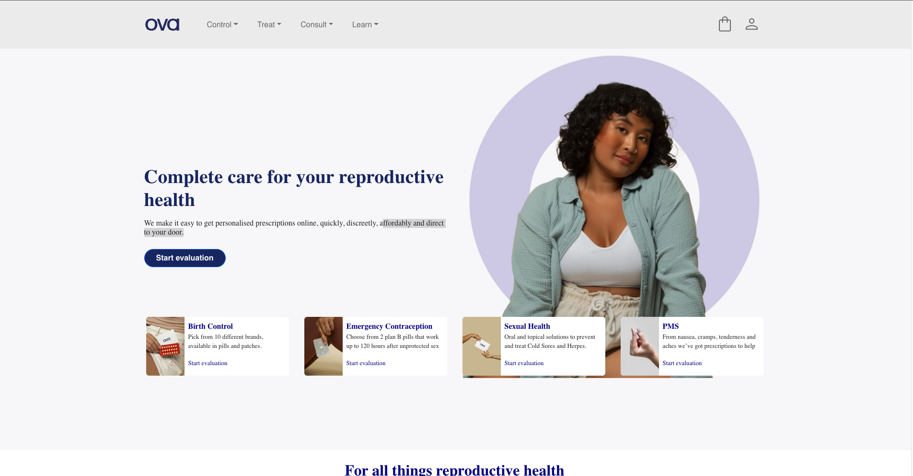
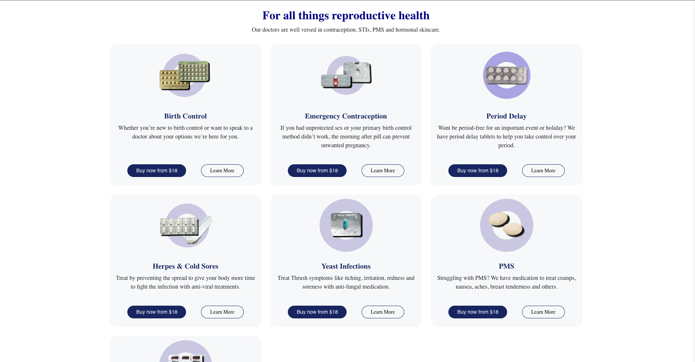
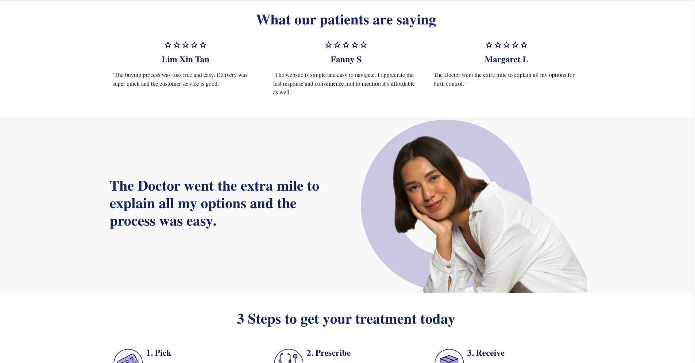
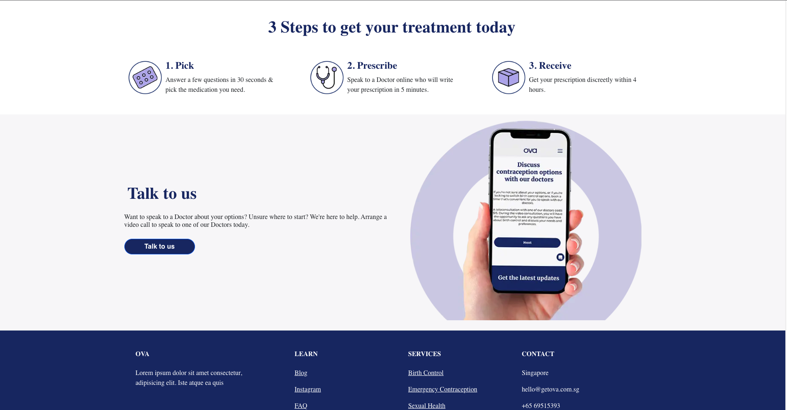
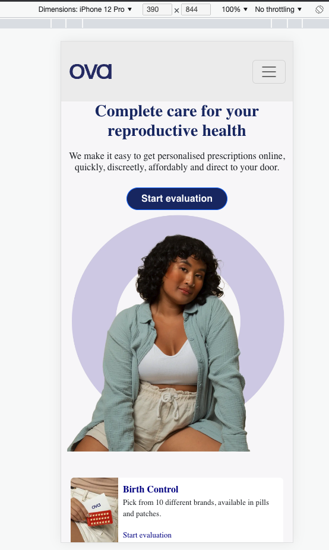
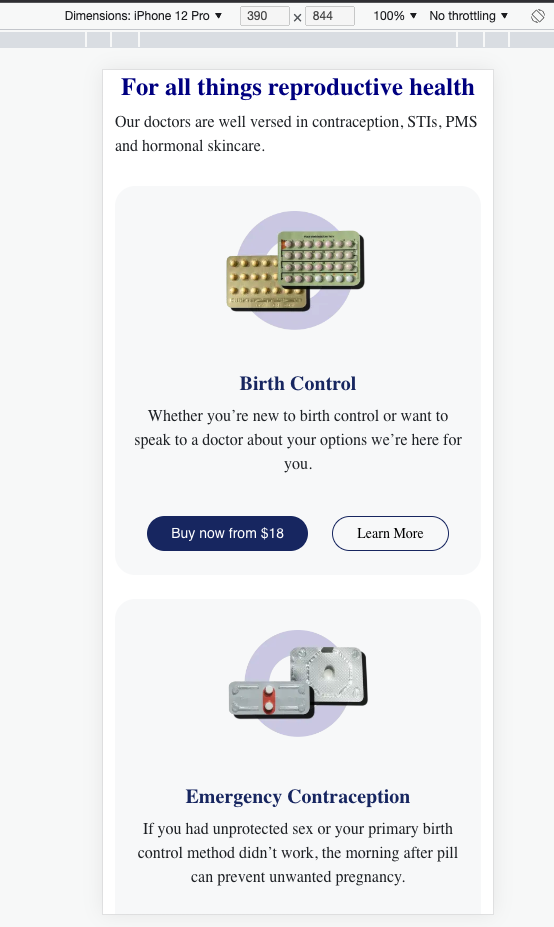
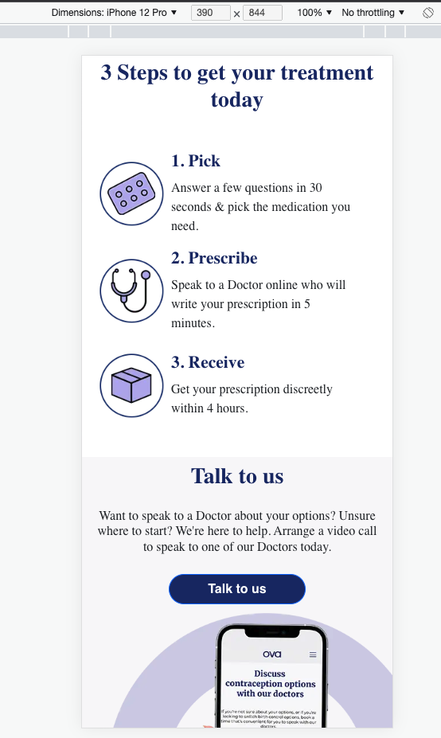
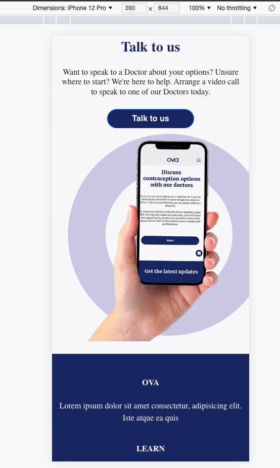

# Practical test for ORA

## Screenshots of Finished Product

---

---

---

## Screenshots of the Finished Product for Mobile:

---

---

---

## What I built?

This was a coding test for ORA where I referred to OVA's website and tried to clone it using ReactJS with TS. The website is fully responsive and I have tried to make it as similar to OVA as possible. I have used Bootstrap 5 to make the website look good on all screen sizes (responsive). For the time being all the data is hard coded as I was not provided with any APIs to fetch data from. I have tried my best to use the best practices, however, there is a lot of room for improvment and the futures file is where you will find a few points on what can be made better. Also please note, I was suffering with COVID-19 while making this, hence, I was working on it very little daily.

## How to run/test the project?

### `npm install`

This will install all dependencies

### `npm start`

Runs the app in the development mode.\
Open [http://localhost:3000](http://localhost:3000) to view it in the browser.

The page will reload if you make edits.\
You will also see any lint errors in the console.

### `npm test`

Launches the test runner in the interactive watch mode.\

### `npm run build`

Builds the app for production to the `build` folder.\
It correctly bundles React in production mode and optimizes the build for the best performance.

The build is minified and the filenames include the hashes.\
Your app is ready to be deployed!

## Additional Notes:

1. I would like to have clarification on if I am suppoed to use any APIs to fetch data or not
2. Footer was taken from Bootstrap
